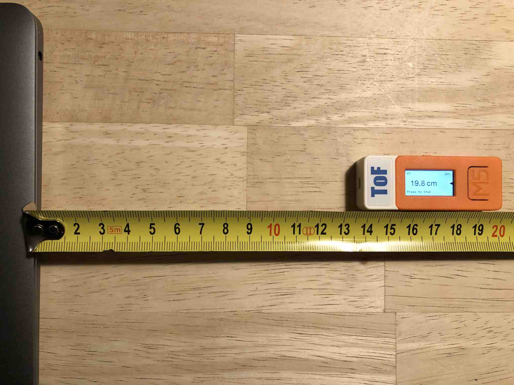

# ranger

Turns your M5StickC with the ToF HAT into a laser rangefinder.

## Overview

This [PlatformIO](https://platformio.org) project turns your [M5StickC](https://docs.m5stack.com/en/core/m5stickc) finger computer into a 
laser rangefinder to precisely measure distances up to 2 meters. For this it
needs the [ToF HAT](https://shop.m5stack.com/collections/m5-hat/products/m5stickc-tof-hatvl53l0x) (Time-of-Flight) attached to the M5StickC.

Besides displaying the measured distance, the software can also stream the current range value to other devices via Bluetooth LE (BLE). This way, the M5StickC with the ToF HAT can
figure as a single point LiDAR to detect obstacles when mounted e.g. on a robot.

To simplify the development of the software, this project uses the synchronous programming language [Blech](https://www.blech-lang.org). Blech helps both with structuring your application in a component oriented way and with handling concurrency and timing tasks prevalent in embedded software. It is also very useful to model and control the UI at an abstract level.

## How to build

Import this Project into PlatformIO and follow the build instructions of the platform. This
would normally consist of invoking the "Build" and "Upload" commands.

To lower the entry barrier, the generated Blech files are checked in. If you want to modify
the Blech code you would have to install and setup the [Blech toolchain](https://www.blech-lang.org/docs/getting-started/blechc/) first. Then, go to the "lib" subdirectory of this project and invoke in a terminal:
> blechc ranger.blc

After that, build and upload as done normally.

## Usage

Attach the ToF HAT to the M5StickC and press on the left side button to start the computer.
It will first show a little boot screen and then present a welcome splash screen before entering the home screen.

From the home screen you can start the ranging measurements by pressing the main button once. The resuslting ranging screen shows the measured distance which gets updated 10 times a second (i.e. at 10Hz).

You can measure either from the top of the HAT or from the bottom of the stick. A little arrow will indicate current mode (see picture above which measures from the back). To change this
setting, first go back to the home screen by pressing the home button once and then enter
the setting menu by either double-pressing the home button or using the secondary button on the right hand side of the device (i.e. not the power button).

By pressing the main button once you can go through the list of all setting options:

- Help & Info : displays some help texts
- Units : allows you to switch the displayed unit between mm, cm and m (sorry, SI units only :-) 
- Offset : change the mode whether to measure from top or bottom of the stick
- Bluetooth : allows you to enable Bluetooth. This is off by default to save battery
- Brightness : adjust the brightnes level of the LCD.

Double click or press on the secondary button to enter a specific setting. To toggle beetween
setting options single press the main button. To change settings double press the main button or single press the secondary button and to leave a screen long press the main button.

The app will use the built in accelerometer to orient the screen to show its contents up-right. At the top of the home and ranging screen information about Bluetooth, USB plug state and the the battery level (state of charge) is displayed.

When a Bluetooth connection is established/lost, the stick is plugged/unplugged via USB or if the battery level drops below 20% or 10%, a corresponding dialog is displayed for a short time on top of the current screen.

To preserve battery, the screen is dimmed down after a short time unless you are on the range measurement screen. Pressing any button will light up the display again.

Unfortunately, the M5StickC is not very power efficient and only has a small battery, so don't expect more than 1 hour of measurement from it.

When Bluetooth is enabled, a single BLE central can connect to the stick and measurement will start independent from the currently visible screen. When the connection is stopped, the measurement will also stop unless you are on the ranging screen.
Besides the measured distance, the current state of charge is also published via BLE.

## Misc

If you are on a Mac, the [RangeExtender](https://github.com/frameworklabs/RangeExtender) project provides a simple Swift API to access the range and battery values notified by the ranger device.

Happy range-finding!
